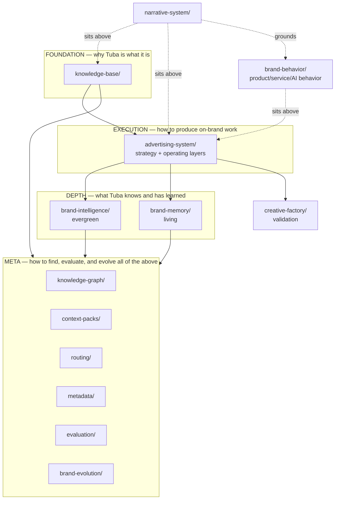
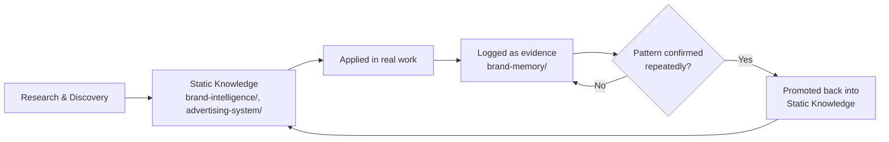
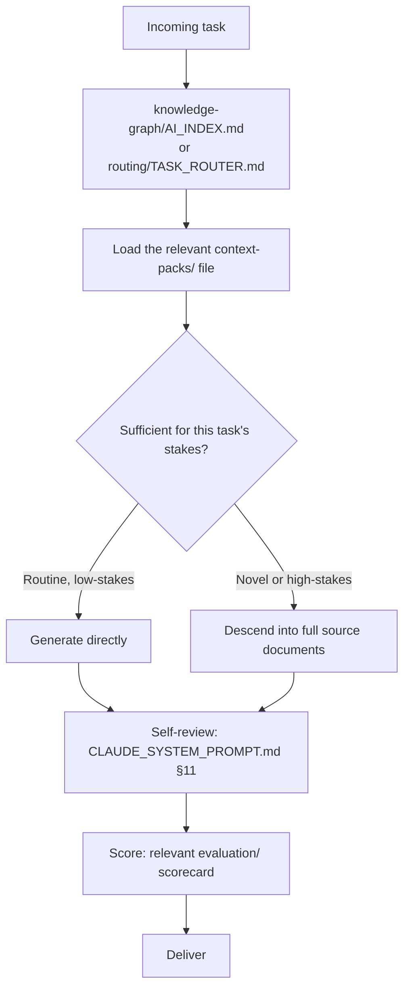
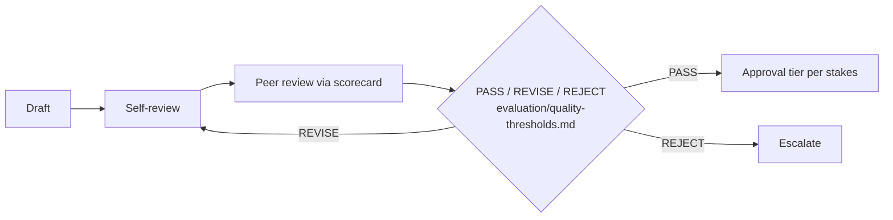

# AI Knowledge Platform — Tuba

> **This is the architecture document for the entire Tuba knowledge ecosystem.** Read this before any other file in the repository, with one exception: if a creative or narrative judgment call is involved — not just an execution task — read [`NARRATIVE_SYSTEM.md`](NARRATIVE_SYSTEM.md) first. It explains what exists, how it's organized, how knowledge flows through it, and how to retrieve exactly what you need — whether you're a human teammate or an AI assistant arriving with zero prior context.

---

## 0. What This Platform Is

Tuba's brand and advertising knowledge has grown from a single logo guideline PDF into a fully layered, AI-native knowledge platform spanning fourteen top-level folders and over 160 documents. It exists because a single brand-guide document cannot simultaneously serve a designer who needs a hex code in five seconds and an AI system that needs full campaign reasoning for a novel task — so instead of one document, this platform is a **system of systems**, each layer built to be loaded only when actually needed.

This platform's validation layer — [`creative-factory/`](creative-factory/) plus [`CREATIVE_FACTORY_REPORT.md`](CREATIVE_FACTORY_REPORT.md) — is where that claim was actually tested: 8 full production-ready campaigns, built by reading only what each task required, scored honestly against the evaluation scorecards below (one landed in REVISE, on purpose, not smoothed over). Read the report before assuming any part of this platform works in practice rather than in theory.

Communication is only half the platform. [`brand-behavior/`](brand-behavior/) plus [`BRAND_BEHAVIOR_SYSTEM.md`](BRAND_BEHAVIOR_SYSTEM.md) is the other half — the layer specifying not what Tuba says, but what Tuba *does*: product, service, AI, and human behavior at every real customer touchpoint. If the task is designing or reviewing a feature, an AI response, an email, a notification, or any UX flow — not writing an ad — start there instead.

If you read only one section of this document, read §7 (Retrieval Strategy) and then go straight to [knowledge-graph/AI_INDEX.md](knowledge-graph/AI_INDEX.md). If the task is creative rather than executional, go to [`NARRATIVE_SYSTEM.md`](NARRATIVE_SYSTEM.md) instead — it sits one level above this document, the way a film's story bible sits above its shot-by-shot production guide. If the task is behavioral rather than communicative, go to [`BRAND_BEHAVIOR_SYSTEM.md`](BRAND_BEHAVIOR_SYSTEM.md) instead.

---

## 1. System Architecture



Seven conceptual layers, fourteen folders:

| Layer | Folders | Answers |
|---|---|---|
| **Narrative** | `narrative-system/` | How Tuba thinks, feels, sees, and tells stories — sits above everything else |
| **Behavior** | `brand-behavior/` | How Tuba behaves — product, service, AI, and human — everywhere communication alone doesn't reach |
| **Foundation** | `knowledge-base/` | Why Tuba is what it is |
| **Execution** | `advertising-system/` | How to produce on-brand advertising, day to day |
| **Depth** | `brand-intelligence/`, `brand-memory/` | What Tuba deeply knows (static) and has actually learned (living) |
| **Meta** | `knowledge-graph/`, `context-packs/`, `routing/`, `metadata/`, `evaluation/`, `brand-evolution/` | How to find, compress, route, tag, score, and evolve everything above |
| **Validation** | `creative-factory/` | Proof the rest of this platform actually produces real creative work — not a documentation layer, a production one |

Plus six root documents: this file, [NARRATIVE_SYSTEM.md](NARRATIVE_SYSTEM.md) (the highest-level creative document, discovered via [BIG_IDEA_PLATFORM.md](BIG_IDEA_PLATFORM.md)), [BRAND_BEHAVIOR_SYSTEM.md](BRAND_BEHAVIOR_SYSTEM.md) (the highest-level behavioral document — what Tuba does, not what it says), [ADVERTISING_IDENTITY_GUIDE.md](ADVERTISING_IDENTITY_GUIDE.md) (the master rulebook), [CLAUDE_SYSTEM_PROMPT.md](CLAUDE_SYSTEM_PROMPT.md) (the compressed behavioral contract), and [CREATIVE_FACTORY_REPORT.md](CREATIVE_FACTORY_REPORT.md) (the validation report — 8 campaigns, scored honestly, system weaknesses named plainly).

## 2. Folder Hierarchy (complete)

```
/
├── NARRATIVE_SYSTEM.md             ← the highest-level creative document — start here for anything creative
├── BIG_IDEA_PLATFORM.md            ← the approved big idea this document expands
├── BRAND_PLATFORM_TRIBUNAL.md      ← the re-adjudication that confirmed the platform for the long term
├── BRAND_BEHAVIOR_SYSTEM.md        ← the highest-level behavioral document — start here for product/service/AI behavior
├── AI_KNOWLEDGE_PLATFORM.md        ← you are here
├── ADVERTISING_IDENTITY_GUIDE.md   ← master rulebook / original index
├── CLAUDE_SYSTEM_PROMPT.md         ← compressed AI behavioral contract
├── CREATIVE_FACTORY_REPORT.md      ← the validation report — 8 real campaigns, scored honestly
│
├── narrative-system/                Narrative: manifesto, world-building, pillars, archetypes, story library, and 15 more
├── brand-behavior/                  Behavior: 29 documents — AI, search, service, trust, errors, personas, scorecard
├── knowledge-base/                 Foundation: project, brand, competitor analysis
├── advertising-system/             Execution: strategy (DNA→campaigns) + operating (checklists→AI prompts)
├── brand-intelligence/             Depth (static): psychology, personas, language, creative libraries
├── brand-memory/                   Depth (living): campaign history, tests, feedback, decisions
│
├── knowledge-graph/                Meta: entities, relationships, taxonomy, ontology, AI's homepage
├── context-packs/                  Meta: 11 compressed (≤300-line) domain summaries
├── routing/                        Meta: 100+ task-to-document mappings + decision trees
├── metadata/                       Meta: frontmatter/tagging/naming/lifecycle standards
├── evaluation/                     Meta: scorecards, thresholds, review prompts, the review process
├── brand-evolution/                Meta: changelog, decisions, timeline, versioning, roadmap
│
├── research/                       Raw competitive intelligence
├── references/                     Pointer index to original source assets
│
├── creative-factory/                Validation: 8 real campaigns, production specs, honest scorecards — see CREATIVE_FACTORY_REPORT.md
│
└── brand-experience/                An executive presentation (Vite + React) — a visual surface of this
                                     platform for the Board, not a documentation layer. See its own README.
```

## 3. Knowledge Flow



Knowledge in this platform is never assumed permanent — it's provisional until re-confirmed by real evidence, but never discarded casually either. Full model: [knowledge-graph/ONTOLOGY.md](knowledge-graph/ONTOLOGY.md).

## 4. Retrieval Strategy

**The core discipline: load the minimum sufficient context, not everything available.**



**Three entry points, by need:**
- **"What do I read for task X?"** → [knowledge-graph/AI_INDEX.md](knowledge-graph/AI_INDEX.md) (full depth, ~20 major tasks) or [routing/TASK_ROUTER.md](routing/TASK_ROUTER.md) (fast lookup, 100+ tasks)
- **"I have a natural-language question"** → [knowledge-graph/QUERY_GUIDE.md](knowledge-graph/QUERY_GUIDE.md)
- **"I need the compressed essentials for a whole domain"** → the matching file in [context-packs/](context-packs/)

Every context pack stays under 300 lines by design and links back to full source documents rather than duplicating them — see [knowledge-graph/ONTOLOGY.md §8](knowledge-graph/ONTOLOGY.md) for the reasoning.

## 5. Memory Strategy

`brand-memory/` is the platform's living record — campaign results, tests, customer feedback, competitor moves, and every major decision, logged continuously as real work happens.

**The one rule that governs it entirely:** never fabricate an entry. As of this platform's founding, every `brand-memory/` file is a template with an explicitly-labeled illustrative example, not real data — see [brand-memory/README.md §2](brand-memory/README.md) and [brand-evolution/DECISIONS.md](brand-evolution/DECISIONS.md)'s decision record on why. A populated-with-fake-data memory layer would be worse than an honestly empty one, because it would silently corrupt every future decision built on it.

**The promotion mechanism:** a pattern that recurs 3+ times in `brand-memory/` (per [brand-memory/lessons-learned.md](brand-memory/lessons-learned.md)) is a candidate for promotion into the corresponding `brand-intelligence/` document at its next scheduled review — this is deliberate and human-reviewed, never automatic.

## 6. Intelligence Strategy

`brand-intelligence/` holds 25 evergreen documents — psychology, five persona families (buyer/seller/broker/developer/investor), three language layers, creative libraries (headlines/CTAs/hooks/storytelling/metaphors), ideation systems, and strategic frameworks (trust/luxury/positioning/differentiation).

**Design principle:** these documents should rarely change. When they do, the change should be evidence-driven (promoted from `brand-memory/`), not opinion-driven — see [knowledge-graph/ONTOLOGY.md §5](knowledge-graph/ONTOLOGY.md)'s Knowledge Hierarchy for how "immutable" through "instance" levels of certainty are meant to behave differently.

## 7. Evaluation Strategy

Every output — copy, design, campaign, or AI prompt — passes through a scored or checklist-based review before shipping, per [evaluation/evaluation-framework.md](evaluation/evaluation-framework.md):



Five scorecards ([brand](evaluation/brand-scorecard.md), [copy](evaluation/copy-scorecard.md), [design](evaluation/design-scorecard.md), [campaign](evaluation/campaign-scorecard.md), [prompt](evaluation/prompt-scorecard.md)) share one unified threshold logic ([evaluation/quality-thresholds.md](evaluation/quality-thresholds.md)), with a hard-boundary override that catches CLAUDE_SYSTEM_PROMPT.md §7 violations regardless of how well an asset otherwise scores.

## 8. Routing Strategy

Three complementary tools, for three different situations (see [routing/TASK_ROUTER.md](routing/TASK_ROUTER.md), [routing/TASK_LIBRARY.md](routing/TASK_LIBRARY.md), [routing/DECISION_TREE.md](routing/DECISION_TREE.md)):

| Tool | Use when |
|---|---|
| [routing/TASK_ROUTER.md](routing/TASK_ROUTER.md) | You know the task, want the fastest document list (110 rows) |
| [routing/TASK_LIBRARY.md](routing/TASK_LIBRARY.md) | You need to know what *inputs* a task requires before starting |
| [routing/DECISION_TREE.md](routing/DECISION_TREE.md) | The task is ambiguous and needs to be classified first |

## 9. Future Expansion Strategy

See [brand-evolution/ROADMAP.md](brand-evolution/ROADMAP.md) for the full list. In brief: this platform is deliberately sequenced, not incomplete by accident. `brand-memory/` populates itself from real work going forward. New context packs, personas, or frameworks are added when a real, recurring need justifies them — per the versioning discipline in [brand-evolution/VERSIONING.md](brand-evolution/VERSIONING.md) and the approval rules in [brand-evolution/README.md §3](brand-evolution/README.md).

---

## 10. The Fastest Possible Onboarding

If you are an AI assistant and can only do three things before starting real work:

1. Load [CLAUDE_SYSTEM_PROMPT.md](CLAUDE_SYSTEM_PROMPT.md) (the hard rules)
2. Check [knowledge-graph/AI_INDEX.md](knowledge-graph/AI_INDEX.md) for your specific task
3. Load the one matching [context-packs/](context-packs/) file

That's it. Everything else — the full 100+ documents — exists to be consulted on demand, not loaded up front. That discipline is the entire point of this platform.

---

## Cross-references
- The original brand rulebook (still fully valid, now one layer inside this architecture): [ADVERTISING_IDENTITY_GUIDE.md](ADVERTISING_IDENTITY_GUIDE.md)
- What Tuba does, not just what it says — product, service, and AI behavior: [BRAND_BEHAVIOR_SYSTEM.md](BRAND_BEHAVIOR_SYSTEM.md), [brand-behavior/](brand-behavior/README.md)
- The compressed behavioral contract: [CLAUDE_SYSTEM_PROMPT.md](CLAUDE_SYSTEM_PROMPT.md)
- The complete document-by-document index: [knowledge-graph/INDEX.md](knowledge-graph/INDEX.md)
- How the whole system conceptually works: [knowledge-graph/ONTOLOGY.md](knowledge-graph/ONTOLOGY.md)
