# Campaign Workflows — Tuba

> **Part of:** [Tuba Advertising Identity System](../ADVERTISING_IDENTITY_GUIDE.md) — Execution Layer
> **Use:** the operational sequence for taking any campaign from idea to reported results. [advertising-playbook.md](advertising-playbook.md) explains the *why* behind each stage and assigns ownership/KPIs; this document is the *flow*.

---

## 0. Master End-to-End Workflow

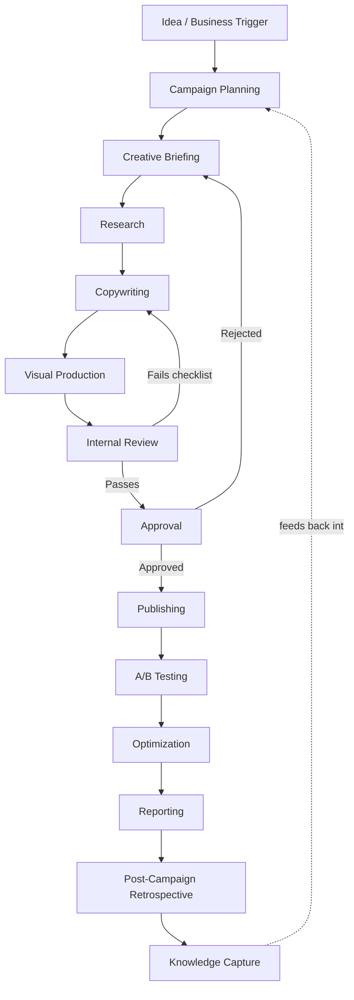

Every arrow in this diagram is a real handoff between roles — see [advertising-playbook.md §5](advertising-playbook.md) for the ownership matrix.

---

## 1. Campaign Planning

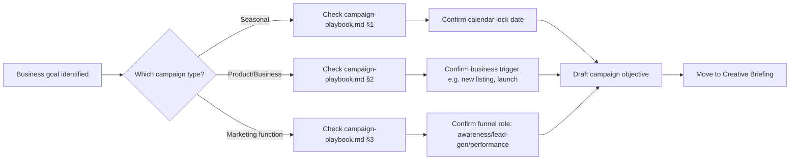

**Inputs:** a business need (new listing, seasonal moment, product launch, KPI gap)
**Outputs:** a one-paragraph campaign objective + assigned campaign type from [campaign-playbook.md](campaign-playbook.md)

---

## 2. Creative Briefing

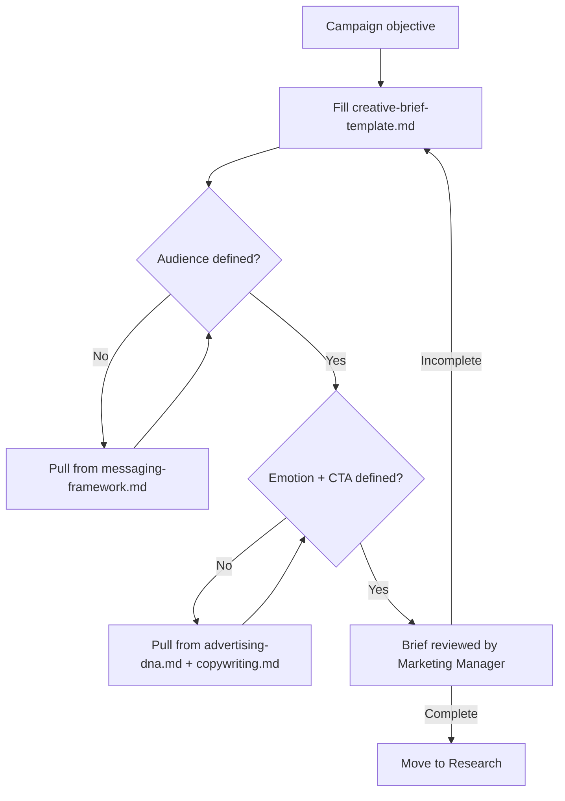

**Owner:** Campaign/Marketing Manager
**Output:** a completed [creative-brief-template.md](creative-brief-template.md) instance, signed off before any copy or design work begins

---

## 3. Research

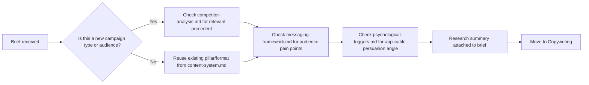

**Rule:** research never starts from a blank page — always check whether [competitor-analysis.md](../knowledge-base/competitor-analysis.md), [content-system.md](content-system.md), or [messaging-framework.md](messaging-framework.md) already answers the question before commissioning new research.

---

## 4. Copywriting

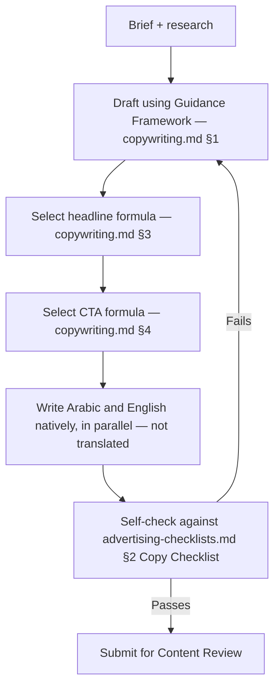

**Output:** bilingual copy pair, ready for [content-review-checklist.md](content-review-checklist.md)

---

## 5. Visual Production

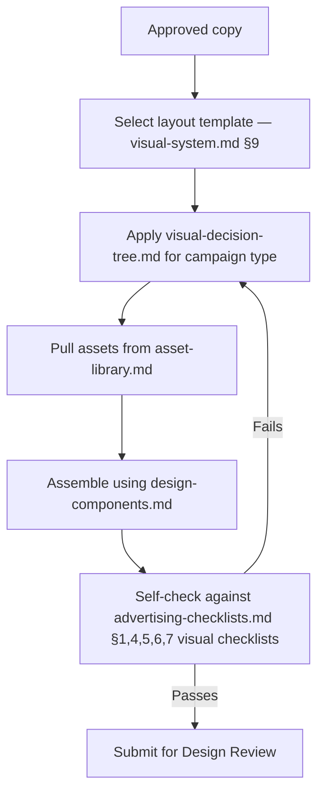

---

## 6. Internal Review (Design + Content combined gate)

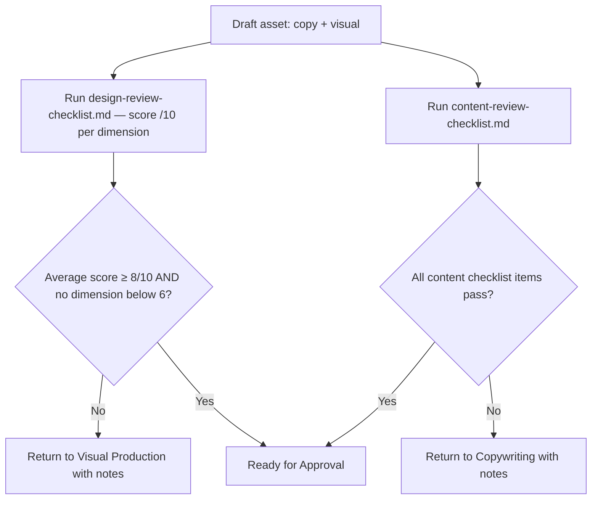

**Quality gate:** an asset does not proceed to Approval unless *both* the design score threshold and content checklist pass — see [design-review-checklist.md §Scoring](design-review-checklist.md) and [advertising-playbook.md §7](advertising-playbook.md) for the exact thresholds and escalation path.

---

## 7. Approval

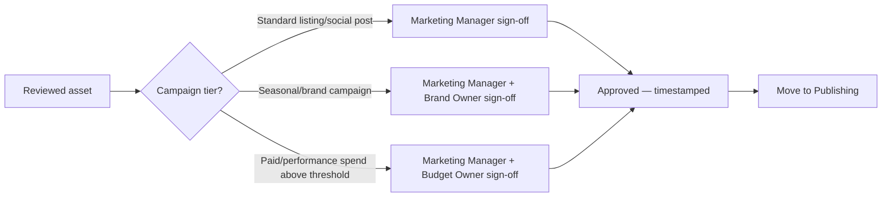

---

## 8. Publishing

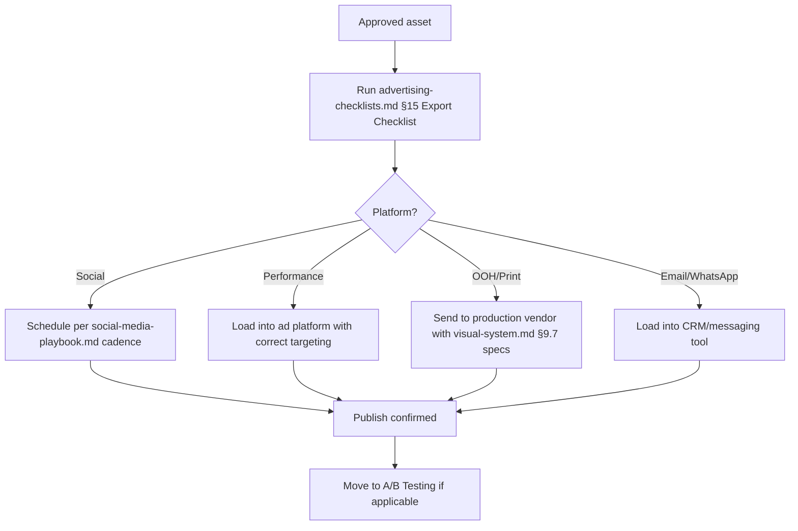

---

## 9. A/B Testing

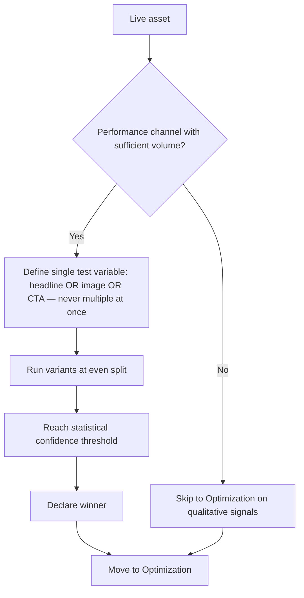

**Rule:** test one variable at a time. A test that changes the headline *and* the image at once produces a result but no learning.

---

## 10. Optimization

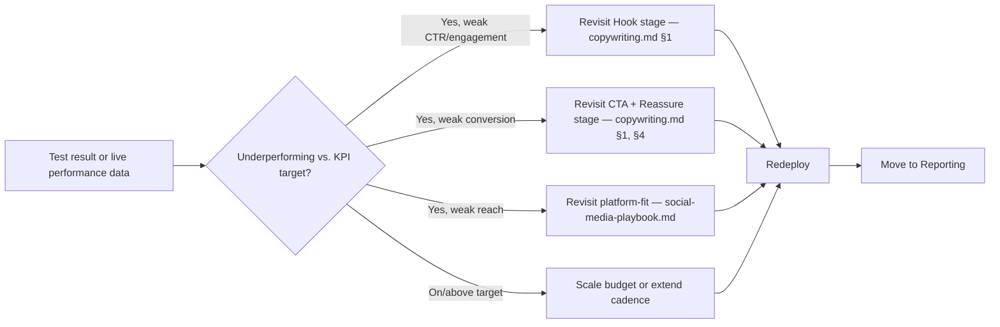

---

## 11. Reporting

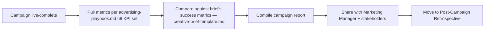

---

## 12. Post-Campaign Retrospective

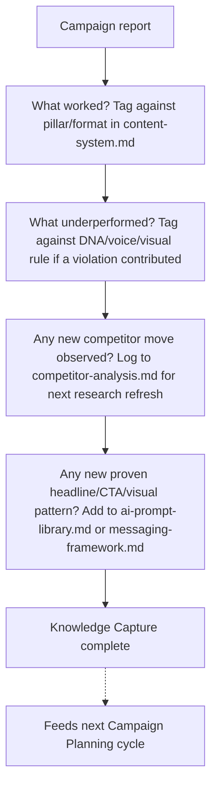

**This is the step most teams skip and the one that compounds the most value over time.** Every retrospective should produce at least one concrete update to a living document in this system (a new proven headline pattern, a corrected assumption in messaging-framework.md, a competitor move worth tracking) — a campaign that doesn't update the system was a one-off, not a system improvement.

---

## Cross-references
- Ownership and KPIs for each stage: [advertising-playbook.md](advertising-playbook.md)
- Brief template used at stage 2: [creative-brief-template.md](creative-brief-template.md)
- Checklists used at stages 4-6, 8: [advertising-checklists.md](advertising-checklists.md), [design-review-checklist.md](design-review-checklist.md), [content-review-checklist.md](content-review-checklist.md)
