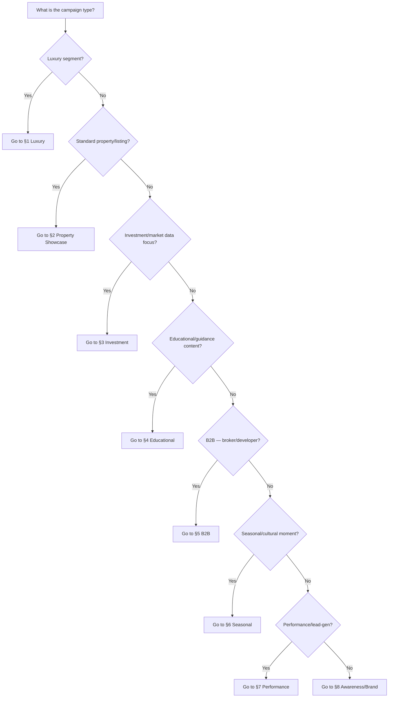
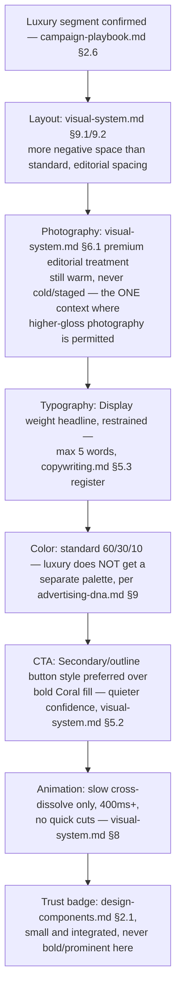
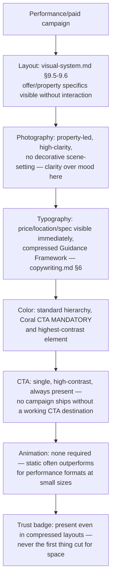

# Visual Decision Tree — Tuba

> **Part of:** [Tuba Advertising Identity System](../ADVERTISING_IDENTITY_GUIDE.md) — Execution Layer
> **Use:** given a campaign type, this document routes to the correct layout, photography style, typography, CTA, and animation treatment — removing guesswork from visual production ([campaign-workflows.md §5](campaign-workflows.md)). Every branch terminates in a specific, existing spec from visual-system.md, iconography.md, or design-components.md — never an open-ended instruction.

---

## 0. Master Routing Tree



---

## 1. Luxury Campaign



---

## 2. Property Showcase (standard listing)

```mermaid
flowchart TD
    A[Standard listing/property content] --> B[Layout: property card — design-components.md §1.1\nor carousel — visual-system.md §9.2]
    B --> C[Photography: visual-system.md §6.2 rules —\nstraightened verticals, sky visible, warm light]
    C --> D[Typography: price leads in Purple/Ink bold,\nspecs in Body/Muted — visual-system.md §2.3]
    D --> E[Color: Coral used once — either the CTA or\na status tag, never both]
    E --> F[CTA: Primary Coral pill — \"Request your property\"\nor \"Talk to a guide\" — copywriting.md §4]
    F --> G[Animation: simple fade/slide between carousel slides,\n200-400ms — visual-system.md §8]
    G --> H[Trust badge: design-components.md §2.1 — MANDATORY,\nbottom of card, always visible]
```

---

## 3. Investment / Market Data

```mermaid
flowchart TD
    A[Investment or market-insight content] --> B[Layout: stat block/stat row —\ndesign-components.md §3.1-3.2]
    B --> C[Visual style: data-visualization-led,\nvisual-system.md §9.8 presentation logic]
    C --> D[Typography: large Display/H1 numeral in Coral\n— the one sanctioned large-Coral-numeral use,\nvisual-system.md §1.7]
    D --> E[Photography: minimal or none — data/illustration\npreferred over lifestyle photography here]
    E --> F[CTA: \"Understand the process\" or link to\nfull Daleel Tuba report — content-system.md §5]
    F --> G[Animation: number count-up on reveal is\nthe one approved exception to \"no flashy motion\"\n— keep under 800ms, ease-out]
    G --> H[Trust element: always cite data source in\nCaption/Muted text below the stat]
```

---

## 4. Educational / Guidance Content

```mermaid
flowchart TD
    A[Educational/guidance content] --> B[Layout: carousel — visual-system.md §9.2\nor infographic — content-system.md §2.2]
    B --> C[Photography/Illustration: illustration preferred for\nprocess explainers — visual-system.md §6.3\nflat, rounded, Purple+Coral+neutral only]
    C --> D[Typography: numbered-step structure,\nH3 per step, Body for explanation]
    D --> E[Color: Purple-dominant, Coral only on step numbers\nor the single CTA]
    E --> F[CTA: \"Understand the process\" —\ncopywriting.md §4]
    F --> G[Animation: icon draw-on reveal per step,\niconography.md §1.2]
    G --> H[Trust element: plain-language definition of any\nregulatory term on first use — copywriting.md §5.4]
```

---

## 5. B2B (Broker / Developer)

```mermaid
flowchart TD
    A[B2B — broker recruitment or developer partnership] --> B[Layout: LinkedIn-native long-form or\npresentation deck — visual-system.md §9.8]
    B --> C[Photography: professional, data-forward —\nagent/office context or masterplan + ground-level\npairing, campaign-playbook.md §2.3]
    C --> D[Typography: Purple-dominant, minimal Coral —\nmost restrained Coral use in the system]
    D --> E[Color: Purple 8 background tint acceptable\nfor data-table sections]
    E --> F[CTA: \"Grow with Tuba\" — copywriting.md §4]
    F --> G[Animation: minimal — static or simple fade only,\nprofessional register does not need motion flourish]
    G --> H[Trust element: lead-quality/verification credibility\npoint mandatory in copy — copywriting.md §5.2]
```

---

## 6. Seasonal / Cultural Campaign

```mermaid
flowchart TD
    A[Seasonal moment identified] --> B{Which occasion?}
    B -->|National Day| C[Check that year's official government theme FIRST\n— campaign-playbook.md §1.1\nUse Saudi-house + desert icon pairing — iconography.md §4]
    B -->|Ramadan| D[Moon icon in brand outline style — NOT generic\ncrescent/lantern stock — campaign-playbook.md §1.3\nFinancing-term framing only, never price-cut framing]
    B -->|Eid| E[Family/gathering Place & Lifestyle photography\nMinimal explicit offer messaging — campaign-playbook.md §1.4]
    B -->|White Friday| F[Performance template — visual-system.md §9.6\nUse the term \"White Friday,\" never \"Black Friday\"\n— campaign-playbook.md §1.5]
    C --> G[Standard color system — NO seasonal palette swap,\nadvertising-dna.md §9]
    D --> G
    E --> G
    F --> G
    G --> H[Animation: gradient ambient motion permitted for\nhero/brand-tier seasonal assets — visual-system.md §8]
```

---

## 7. Performance / Lead Generation



---

## 8. Awareness / Brand Campaign

```mermaid
flowchart TD
    A[Brand/awareness campaign] --> B[Layout: visual-system.md §9.7 OOH-legibility standard\napplies even to digital — one headline, minimal copy]
    B --> C[Photography or Gradient: highest production value\nin the calendar — full brand system expression]
    C --> D[Typography: Display weight, brand promise-adjacent\nheadline — advertising-dna.md §2]
    D --> E[Color: full 60/30/10 hierarchy at maximum\nproduction polish]
    E --> F[CTA: soft brand CTA acceptable\n— e.g., \"Find your Tuba\" name-play formula,\ncopywriting.md §3]
    F --> G[Animation: full motion system available —\nlogo motion, gradient ambient loop, icon draw-on\n— visual-system.md §8]
    G --> H[This is the one campaign type where PR/earned-media\nsupport should be actively planned — campaign-playbook.md §3.4]
```

---

## Cross-references
- Every terminal node traces to: [visual-system.md](visual-system.md), [iconography.md](iconography.md), [design-components.md](design-components.md), [copywriting.md](copywriting.md), [campaign-playbook.md](campaign-playbook.md)
- Where this fits in the process: [campaign-workflows.md §5](campaign-workflows.md)
