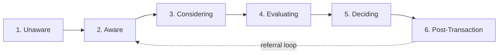

# Customer Journey — Tuba

> **Layer:** Brand Intelligence (static)
> **Purpose:** the master journey map that ties personas ([buyer-personas.md](buyer-personas.md), [seller-personas.md](seller-personas.md), [broker-personas.md](broker-personas.md), [developer-personas.md](developer-personas.md), [investor-personas.md](investor-personas.md)), triggers ([decision-triggers.md](decision-triggers.md)), and funnel roles ([content-system.md §3](../advertising-system/content-system.md)) into one map of how someone actually moves from unaware to loyal advocate.
> **Owner:** Marketing Strategy lead
> **Review frequency:** annually
> **Related documents:** [advertising-dna.md §12](../advertising-system/advertising-dna.md), [content-system.md](../advertising-system/content-system.md), [psychological-triggers.md](../advertising-system/psychological-triggers.md)

---

## 1. The Six Stages

## 2. Stage-by-Stage Detail

### Stage 1: Unaware
**State:** hasn't yet recognized a real estate need, or doesn't know Tuba exists as an option.
**Trigger that moves them forward:** an external life-event trigger (decision-triggers.md §2) or organic content discovery (Place & Lifestyle, market-insight content — content-system.md pillars 2-3).
**Content role:** Evergreen, Viral/shareable (content-system.md §3) — awareness-building content that doesn't require an active search intent.
**Feeling to create:** curiosity, recognition ("that's actually relevant to me").

### Stage 2: Aware
**State:** knows they may need to buy/rent/sell/invest soon, has heard of or encountered Tuba.
**Trigger that moves them forward:** a specific piece of content or a social/referral mention that makes Tuba feel relevant to their specific situation.
**Content role:** Authority, Trust (content-system.md §3) — establishing credibility before an active ask.
**Feeling to create:** "this platform seems to actually understand my situation."

### Stage 3: Considering
**State:** actively comparing options — other platforms, agents, or the buy-vs-rent-vs-wait decision itself.
**Trigger that moves them forward:** content or a data point that differentiates Tuba from generic alternatives (competitor-analysis.md §11).
**Content role:** Lead generation content, educational/guidance content.
**Feeling to create:** confidence that Tuba is a serious, credible option, not just "another app."

### Stage 4: Evaluating
**State:** engaging directly — browsing listings, submitting a property request, talking to an agent.
**Trigger that moves them forward:** a strong match (request-first mechanic), fast/human response, resolved hesitation (decision-triggers.md §4).
**Content role:** Conversion content, property showcase, trust badges front and center.
**Feeling to create:** relief that the process is manageable and someone is actually helping.

### Stage 5: Deciding
**State:** at or near the transaction point — final questions, paperwork, financing confirmation.
**Trigger that moves them forward:** clear, singular next step; final objection resolved (Reassure stage, copywriting.md §1).
**Content role:** Conversion content, direct human support.
**Feeling to create:** confidence, quiet pride (approaching Decide-stage emotional register — emotional-keywords.md §5).

### Stage 6: Post-Transaction
**State:** transaction complete — now a past customer with either a home, a sale, or a completed listing.
**Trigger that moves them into the referral loop:** a genuinely good experience, low-pressure follow-up, relevant ongoing content (market updates for their area).
**Content role:** Retention, Referral content (content-system.md §3, campaign-playbook.md §3.2).
**Feeling to create:** "I want to tell someone about this" (advertising-dna.md §12's stated post-transaction goal).

---

## 3. Journey Map by Persona (relative speed and emotional intensity)

| Persona | Journey length | Emotional intensity | Where they need the most support |
|---|---|---|---|
| First-time buyer | Long | High | Stage 3-4 (Considering/Evaluating) |
| Luxury buyer | Long, relationship-first | Restrained but high-stakes | Stage 2-3, via direct relationship not broad content |
| Investor | Medium, research-heavy | Low-medium | Stage 3 (data-driven Considering) |
| Tenant/Renter | Short | Medium (time-pressured) | Stage 4 (fast Evaluating) |
| Distressed Seller | Short, sensitive | High | Stage 4-5, human contact critical |
| Broker (acquisition) | Medium-long, B2B cycle | Low-medium | Stage 3 (proof-driven Considering) |
| Developer (partnership) | Long, formal B2B cycle | Low | Stage 3-4, case-study driven |

## 4. Where Proof Points Matter Most (mapped to market-psychology.md §7)

| Stage | Dominant proof type |
|---|---|
| Unaware/Aware | Public content quality, organic reach/shareability |
| Considering | Public social proof (reviews, market data) + personal-network referral |
| Evaluating | Platform-level trust signals (FAL badge, verification) |
| Deciding | Direct human reassurance, agent responsiveness |
| Post-Transaction | Personal-network referral (their own word-of-mouth becomes the next cycle's proof) |

## 5. Content-to-Stage Mapping

| Stage | Primary content pillar (content-system.md §1) |
|---|---|
| Unaware | Place & Lifestyle |
| Aware | Market Insight, Trust & Compliance |
| Considering | Guidance & Education |
| Evaluating | Property Showcase |
| Deciding | Trust & Compliance, direct support |
| Post-Transaction | Community & Customer Success |

---

## Best Practices
- Every campaign brief (creative-brief-template.md) should state which journey stage it's targeting — a Stage 1 (Unaware) asset and a Stage 5 (Deciding) asset should never use the same CTA intensity
- Use §4's proof-point mapping to decide what kind of trust signal to lead with at each stage — don't front-load platform badges at Stage 1 when public content quality is what actually earns attention

## Common Mistakes
- Asking for a high-commitment action (Stage 5 CTA) at a Stage 1-2 touchpoint — mismatches trigger fatigue and low conversion
- Treating the journey as strictly linear — real customers loop back (e.g., a Stage 4 evaluator returning to Stage 3 research after a hesitation trigger, decision-triggers.md §4)

## Future Expansion Notes
- Once real funnel-conversion data exists, annotate this map with actual stage-to-stage conversion rates and update at each annual review; log real-time anomalies to [brand-memory/marketing-insights.md](../brand-memory/marketing-insights.md)
