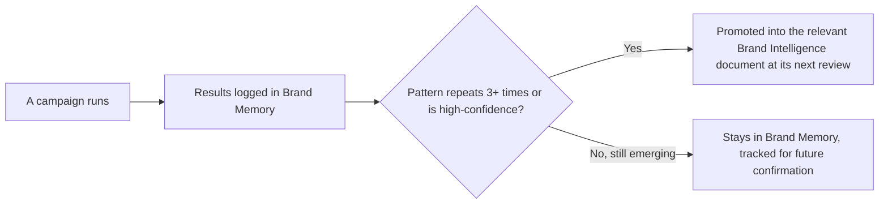

# Brand Memory — README

> **This folder is Tuba's living memory.** Unlike [brand-intelligence/](../brand-intelligence/), which holds stable strategic knowledge, everything here is meant to **grow continuously** — every campaign, experiment, customer conversation, and competitor move that happens after this system was built should leave a trace in this folder.

---

## 1. What Brand Memory Is For

Brand Intelligence answers "how does Tuba think?" Brand Memory answers **"what has Tuba actually learned?"** The two layers are connected deliberately: a pattern that shows up repeatedly in Brand Memory (a winning headline formula, a consistently-asked customer question, a competitor pattern that keeps recurring) is a candidate for **promotion** into the corresponding Brand Intelligence document at its next review cycle. Brand Memory is the evidence; Brand Intelligence is the settled conclusion.

## 2. Current State — Important Context for Any Reader

**As of this system's initial build, no campaigns have yet been run under this identity system.** Every file in this folder is a **structure and template**, not a populated history — deliberately. Fabricating campaign results, performance numbers, or customer quotes to make this folder look "complete" would violate the same honesty standard this entire system enforces everywhere else (advertising-dna.md §5, psychological-triggers.md §2's fabricated-social-proof prohibition applies with equal force to internal documentation). Where a file needs an example to demonstrate its format, that example is explicitly labeled **"ILLUSTRATIVE — not a real record."**

**The first real entry in each file should come from the first real campaign, experiment, or observation made after this system goes live.**

## 3. Update Frequency

| File type | Update trigger |
|---|---|
| campaign-history.md, winning-campaigns.md, failed-campaigns.md | Every campaign, at completion (advertising-playbook.md §1, Stage 10) |
| creative-experiments.md, ab-tests.md | Every test, at conclusion |
| copy-library.md, visual-library.md | Whenever a new approved asset is finalized |
| headline-performance.md, cta-performance.md | Monthly rollup from live campaign data |
| customer-feedback.md | Continuously, as feedback arrives (weekly triage minimum) |
| marketing-insights.md, market-observations.md | As insights emerge, reviewed monthly |
| competitor-watch.md | As competitor moves are observed, reviewed monthly |
| monthly-retrospectives.md | Monthly, fixed cadence |
| lessons-learned.md | Whenever a retrospective or incident produces a durable lesson |
| knowledge-log.md | Whenever a real strategic decision about Tuba's brand/marketing is made |

## 4. Ownership

| Role | Responsibility |
|---|---|
| **Marketing/Campaign Manager** | Primary owner of campaign-history.md, winning/failed-campaigns.md, creative-experiments.md, ab-tests.md — logs every campaign at close (advertising-playbook.md §1, Stage 10's Knowledge Capture requirement) |
| **Copy lead** | Owns copy-library.md, headline-performance.md, cta-performance.md |
| **Design lead** | Owns visual-library.md |
| **Customer/Support-facing team** | Feeds customer-feedback.md — triaged by Marketing Strategy lead |
| **Marketing Strategy lead** | Owns marketing-insights.md, market-observations.md, competitor-watch.md, monthly-retrospectives.md |
| **Brand Owner** | Owns lessons-learned.md and knowledge-log.md — the two files recording durable, strategic-level learning |

## 5. Governance

- **No entry is deleted**, even a failed campaign or a wrong decision — Brand Memory's value depends on completeness, including failures (see [failed-campaigns.md](failed-campaigns.md)'s explicit no-blame policy)
- **Every entry is attributed** (who logged it, when) so questions can be routed to the right person
- **Every entry links back** to the relevant Brand Intelligence or Advertising System document it relates to — Brand Memory should never exist in isolation from the strategic reasoning it's testing
- **No fabricated entries, ever** — see §2. An empty file with a clear template is more valuable than a populated one with invented data

## 6. Review Process

| Cadence | Review |
|---|---|
| Weekly | Customer-feedback.md triage |
| Monthly | monthly-retrospectives.md compiled from that month's campaign-history.md, ab-tests.md, and customer-feedback.md entries |
| Quarterly | marketing-insights.md and competitor-watch.md reviewed for patterns worth promoting to Brand Intelligence |
| Annually (synced to Brand Intelligence's own review cycle) | Full sweep — check every Brand Intelligence document against accumulated Brand Memory evidence; promote confirmed patterns, retire disproven assumptions |

## 7. How to Add an Entry (general template)

Every Brand Memory file follows this discipline: use the file's specific template (defined in that file), always include a date, always link to related documents, and always state what should happen next (a follow-up test, a promotion candidate, a lesson to remember) — a log entry that doesn't produce a forward action is incomplete.

---

## Cross-references
- The strategic layer this memory eventually feeds: [brand-intelligence/](../brand-intelligence/)
- The process this memory captures output from: [advertising-playbook.md](../advertising-system/advertising-playbook.md)
- The master index: [ADVERTISING_IDENTITY_GUIDE.md](../ADVERTISING_IDENTITY_GUIDE.md)
