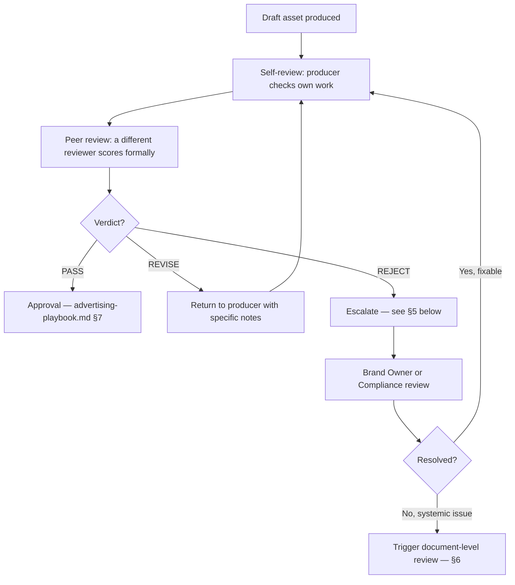
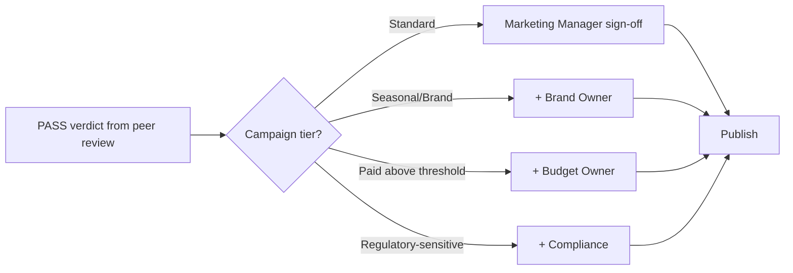
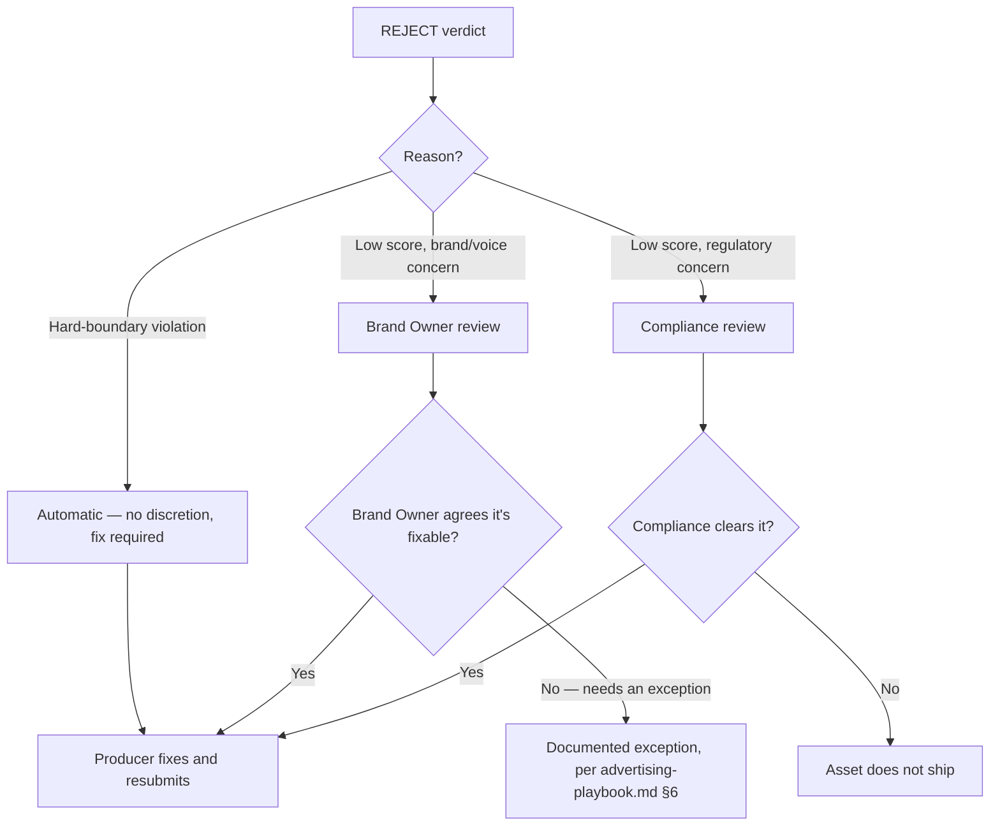
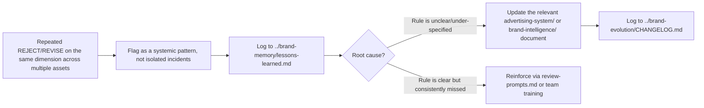

# Evaluation Framework

> **Part of:** [AI_KNOWLEDGE_PLATFORM.md](../AI_KNOWLEDGE_PLATFORM.md)
> **Purpose:** the master explanation of how every Tuba output should be evaluated before approval — ties together the scorecards, thresholds, and review prompts in this folder into one governed process. Complements, does not duplicate, [../advertising-system/advertising-playbook.md](../advertising-system/advertising-playbook.md)'s broader production-process ownership matrix — this document is specifically about the *evaluation* stage within that larger process.
> **Owner:** Brand Owner
> **Review frequency:** annually

---

## 1. Review Stages

**Stage 1 — Self-review:** the producer runs the relevant checklist ([../advertising-system/advertising-checklists.md](../advertising-system/advertising-checklists.md)) before submitting anything for formal review. This is not optional — see [../advertising-system/advertising-playbook.md §4](../advertising-system/advertising-playbook.md)'s "do not submit known-failing work" rule.

**Stage 2 — Peer review:** a reviewer who did **not** produce the asset applies the relevant scorecard(s) from this folder, using [review-prompts.md](review-prompts.md) if AI-assisted.

**Stage 3 — Approval:** per the tiered structure in [../advertising-system/advertising-playbook.md §3](../advertising-system/advertising-playbook.md) (Standard/Seasonal-Brand/Paid-above-threshold/Regulatory-sensitive).

## 2. Ownership

| Stage | Who |
|---|---|
| Self-review | The producer (copywriter, designer, or AI system generating the draft) |
| Peer review | A different qualified reviewer — per each scorecard's stated Owner |
| Approval | Marketing Manager (+ Brand Owner / Budget Owner / Compliance as the tier requires) |
| Escalation resolution | Brand Owner (brand/voice issues) or Compliance (regulatory issues) |
| Document-level fixes (§6) | Knowledge Platform maintainer, with the relevant document's stated Owner |

Full role definitions: [../advertising-system/advertising-playbook.md §2](../advertising-system/advertising-playbook.md).

## 3. Approval Flow

## 4. Quality Gates (where evaluation is mandatory, not optional)

| Gate | Required scorecard(s) |
|---|---|
| Before any commerce-adjacent asset ships | [brand-scorecard.md](brand-scorecard.md) (Trust dimension minimum) |
| Before any copy is finalized | [copy-scorecard.md](copy-scorecard.md) or [../advertising-system/content-review-checklist.md](../advertising-system/content-review-checklist.md) |
| Before any visual asset is finalized | [design-scorecard.md](design-scorecard.md) or [../advertising-system/design-review-checklist.md](../advertising-system/design-review-checklist.md) |
| Before a campaign brief is approved for production | [campaign-scorecard.md](campaign-scorecard.md) (Brief-stage use) |
| Before a campaign is logged as complete | [campaign-scorecard.md](campaign-scorecard.md) (Post-completion use) |
| Before a new prompt joins the AI prompt library | [prompt-scorecard.md](prompt-scorecard.md) |

## 5. Escalation Path

## 6. Continuous Improvement Loop

This loop is the practical mechanism behind the platform's broader "Memory Feedback Loop" ([../knowledge-graph/RELATIONSHIPS.md §5](../knowledge-graph/RELATIONSHIPS.md)) — evaluation failures are a primary source of evidence for what needs to change in the static knowledge layer.

---

## Best Practices
- Never skip Stage 1 (self-review) "to save time" — it's the cheapest place to catch an issue, and skipping it just moves the cost to Stage 2 or later
- Treat a recurring REJECT pattern as a system signal (§6), not a training issue to repeat-correct indefinitely

## Common Mistakes
- Treating peer review as optional for "obviously fine" routine content — the self-review/peer-review split exists because self-assessment is the least reliable check (same principle as [brand-scorecard.md](brand-scorecard.md)'s "get a second reviewer" note)
- Resolving an escalation informally without logging it — every escalation resolution should be traceable per [../brand-memory/knowledge-log.md](../brand-memory/knowledge-log.md) or [../brand-evolution/DECISIONS.md](../brand-evolution/DECISIONS.md) if it changes a rule

## Cross-references
- The broader production process this evaluation stage sits inside: [../advertising-system/advertising-playbook.md](../advertising-system/advertising-playbook.md)
- All scorecards: [brand-scorecard.md](brand-scorecard.md), [copy-scorecard.md](copy-scorecard.md), [design-scorecard.md](design-scorecard.md), [campaign-scorecard.md](campaign-scorecard.md), [prompt-scorecard.md](prompt-scorecard.md)
- Verdict logic: [quality-thresholds.md](quality-thresholds.md)
- Reusable review prompts: [review-prompts.md](review-prompts.md)
