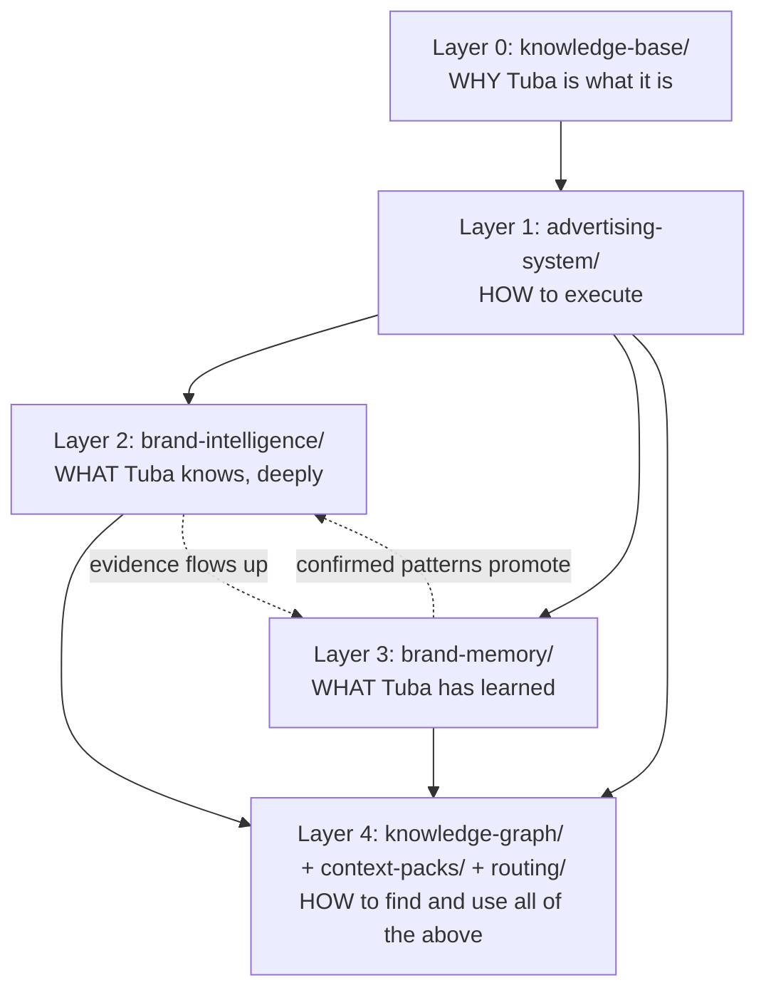
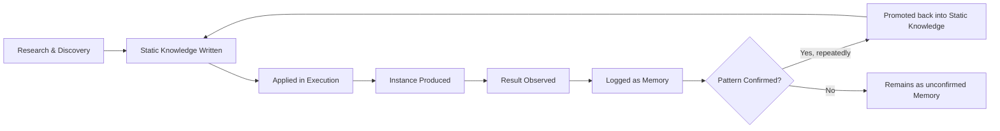
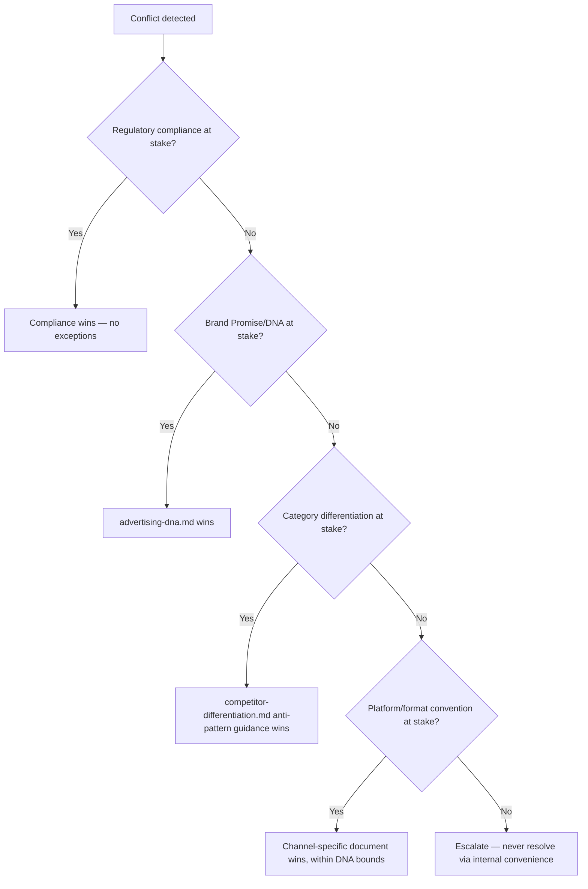
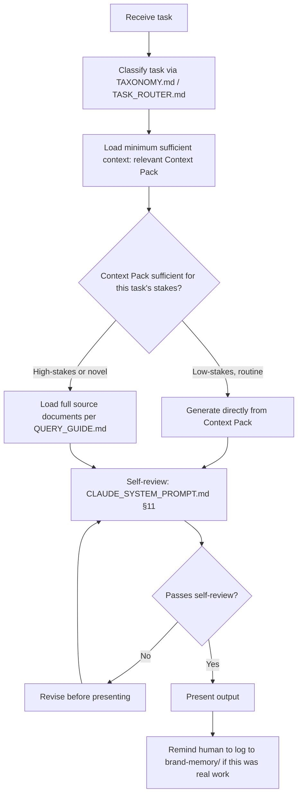

# Knowledge Graph — Ontology

> **Part of:** [AI_KNOWLEDGE_PLATFORM.md](../AI_KNOWLEDGE_PLATFORM.md)
> **Purpose:** the conceptual model underneath the platform — not *what* the entities and documents are ([ENTITIES.md](ENTITIES.md), [TAXONOMY.md](TAXONOMY.md)) but *how the system as a whole is meant to behave*: what inherits from what, which way dependencies flow, and how knowledge, decisions, and AI reasoning are supposed to move through it.
> **Owner:** Knowledge Platform maintainer / Brand Owner
> **Review frequency:** annually, or whenever the platform's fundamental structure changes

---

## 1. Objects

The platform recognizes two fundamental object types:

| Object type | Definition | Examples |
|---|---|---|
| **Knowledge objects** | Stable, evergreen — describe what is durably true | A persona, a color rule, a psychological principle |
| **Memory objects** | Time-stamped, evidential — describe what actually happened | A campaign result, a logged decision, a customer quote |

Every document in the platform is composed primarily of one type or the other — see [TAXONOMY.md §2](TAXONOMY.md) for which documents hold which. A well-formed platform never lets Memory objects masquerade as Knowledge (no fabricated "typical results" presented as settled fact — see [brand-memory/README.md §2](../brand-memory/README.md)).

## 2. Relationships

Relationships are directional edges between objects (full catalog: [RELATIONSHIPS.md](RELATIONSHIPS.md)). Ontologically, three relationship *classes* exist:

1. **Constitutive** (X is made of/defines Y) — e.g., advertising-dna.md's principles constitute the tests every other document must pass
2. **Instrumental** (X is used to produce Y) — e.g., headline-library.md is used to produce Content
3. **Evidential** (X is proof for/against Y) — e.g., ab-tests.md results are evidence for or against a headline-performance.md ranking

## 3. Inheritance

The platform is a strict inheritance hierarchy — a lower-numbered layer's rules are inherited by every layer above it, and a higher layer may *specialize* but never *contradict* a lower one:



**Inheritance rule:** a luxury-segment copy rule in [luxury-framework.md](../brand-intelligence/luxury-framework.md) *specializes* copywriting.md's general rules (still one CTA, still no fabricated claims) — it never overrides advertising-dna.md's Forbidden Territory (§5). If a specialized document ever seems to license something a foundational document forbids, the foundational document wins (this is formalized as Decision Priority #2 in [CLAUDE_SYSTEM_PROMPT.md §9](../CLAUDE_SYSTEM_PROMPT.md)).

## 4. Dependencies

Dependencies flow **downward only** in the diagram above — Layer 2 (brand-intelligence) may cite and depend on Layer 1 (advertising-system) and Layer 0 (knowledge-base), but Layer 0/1 documents must never depend on Layer 2/3 content to make their core claims (a foundational rule can't require a persona file to be true first). The one designed exception is the **promotion loop**: Layer 3 (Memory) evidence can trigger a *scheduled, deliberate* revision of Layer 2 (Intelligence) content — this is not a live dependency, it's a periodic, human-reviewed update process (see [brand-memory/README.md §1](../brand-memory/README.md)).

## 5. Knowledge Hierarchy

```
Immutable (current-brand-analysis.md's "what must never change")
  → Foundational (advertising-dna.md's promise/principles/archetype)
    → Systemic (visual-system.md, copywriting.md — full execution rules)
      → Specialized (luxury-framework.md, trust-framework.md — context-specific applications)
        → Instance (a specific campaign, a specific piece of copy)
          → Evidence (a logged result in brand-memory/)
```

Each level down is more specific and more revisable than the level above. The Immutable level (logo construction, core hex values) should essentially never change short of an official rebrand; the Evidence level changes daily.

## 6. Knowledge Flow



This is the same cycle as [RELATIONSHIPS.md §5](RELATIONSHIPS.md), presented here as the ontological *reason* the platform is built this way: **knowledge in this system is never assumed permanent — it is always provisional until re-confirmed by real evidence**, but it is also never discarded casually — see the no-blame, no-deletion policies in [brand-memory/failed-campaigns.md](../brand-memory/failed-campaigns.md) and [brand-memory/README.md §5](../brand-memory/README.md).

## 7. Decision Flow

When two pieces of guidance conflict, the platform resolves it through a fixed priority order (full detail: [CLAUDE_SYSTEM_PROMPT.md §9](../CLAUDE_SYSTEM_PROMPT.md)):



## 8. AI Reasoning Flow

The ontological model an AI assistant should follow for any Tuba task — this is the reasoning-level counterpart to the retrieval-level flow in [RELATIONSHIPS.md §7](RELATIONSHIPS.md):



**Ontological principle behind this flow:** an AI system operating on Tuba should treat *retrieval discipline* (loading only what's needed) and *reasoning discipline* (checking against hard rules before output) as equally important — a fast answer that skips §G-H's self-review is not actually faster once a correction cycle is counted.

---

## Best Practices
- Treat inheritance (§3) as the tiebreaker whenever a specialized document's guidance feels like it's stretching a foundational rule — check the foundational document directly rather than assuming the specialization is safe
- Use the Decision Flow (§7) literally, in order, rather than case-by-case improvisation

## Common Mistakes
- Treating brand-memory/ evidence as immediately authoritative over brand-intelligence/ static knowledge — the promotion process (§6) is deliberate and reviewed, not automatic
- Skipping the AI Reasoning Flow's self-review step (§8) under time pressure — this is exactly the failure mode CLAUDE_SYSTEM_PROMPT.md §11 exists to prevent

## Cross-references
- The graph this ontology governs: [RELATIONSHIPS.md](RELATIONSHIPS.md)
- The classification this ontology organizes: [TAXONOMY.md](TAXONOMY.md)
- The practical retrieval instructions built on this model: [QUERY_GUIDE.md](QUERY_GUIDE.md)
