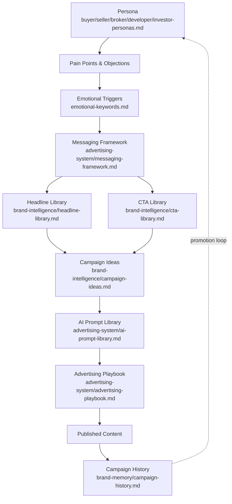
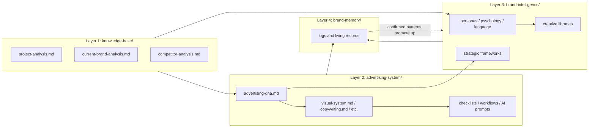
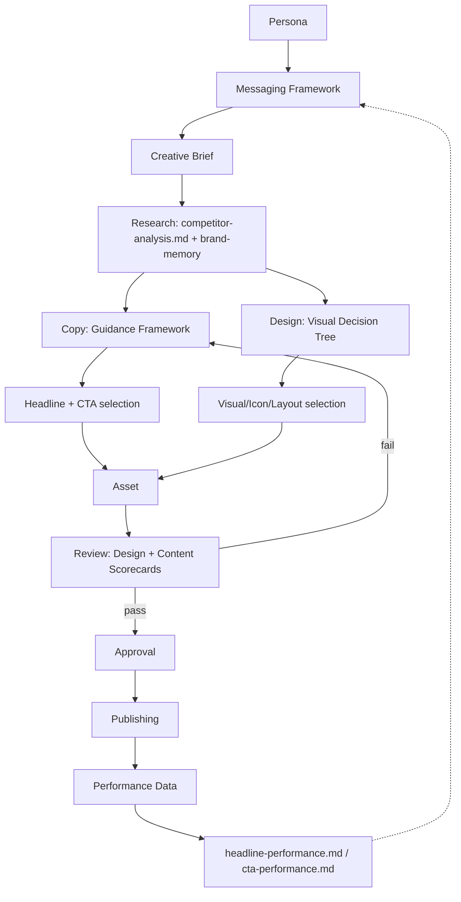
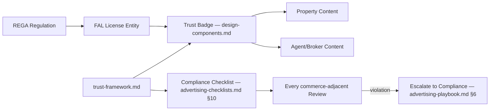
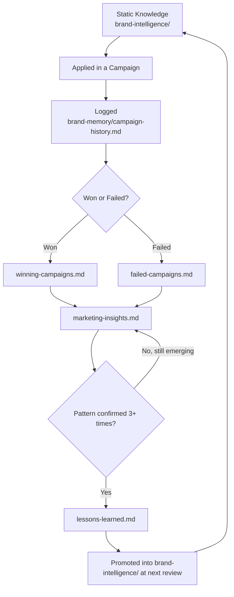
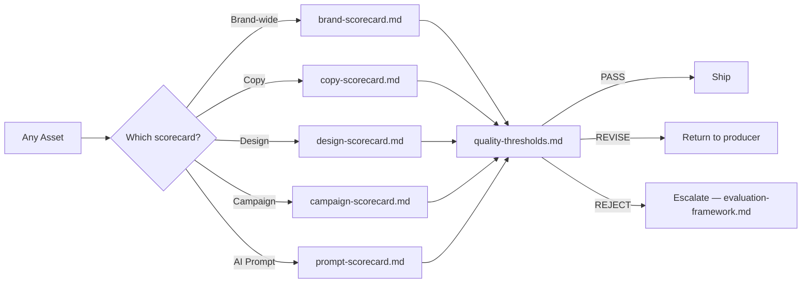
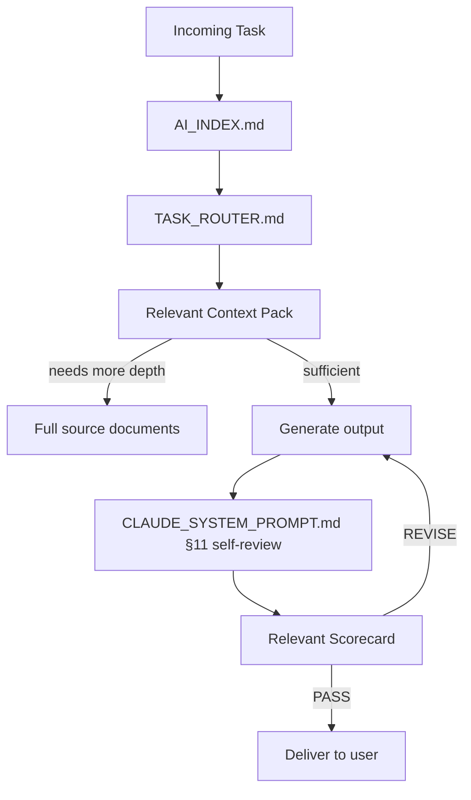

# Knowledge Graph — Relationships

> **Part of:** [AI_KNOWLEDGE_PLATFORM.md](../AI_KNOWLEDGE_PLATFORM.md)
> **Purpose:** the complete relationship graph connecting every [entity](ENTITIES.md) in the Tuba knowledge platform — represented as Mermaid diagrams so both humans and AI systems can trace "what feeds what" without reading every document.
> **Owner:** Knowledge Platform maintainer
> **Review frequency:** whenever a new document or entity relationship is introduced

---

## 1. The Persona-to-Execution Pipeline

The core creative-production chain — how understanding an audience becomes a shipped, evaluated asset:

## 2. Document Layer Dependency Graph

How the four major layers depend on each other:

## 3. Content Production Relationship Graph

## 4. Trust & Compliance Relationship Graph

## 5. Memory Feedback Loop (the system's learning cycle)

## 6. Evaluation & Quality Gate Relationship Graph

## 7. AI Retrieval Relationship Graph

How an AI assistant should traverse the graph for any incoming task:

---

## 8. Relationship Type Legend

| Relationship type | Meaning | Example |
|---|---|---|
| **informs** | One entity's content shapes another's decisions | Persona informs Messaging Framework |
| **produces** | One entity generates instances of another | Campaign produces Content |
| **belongs-to** | Membership/categorization | Persona belongs-to Audience |
| **governs** | One entity constrains what's valid for another | Rule governs Asset |
| **feeds** | One entity's output becomes another's input | Performance Data feeds Headline Performance |
| **promotes-to** | A Memory pattern becomes Intelligence | Lessons Learned promotes-to Brand Intelligence |
| **evaluates** | A Scorecard entity assesses another | Copy Scorecard evaluates Content |

## Best Practices
- When adding a new document, place it in the relevant Mermaid graph above (or add a new graph) so its dependencies are traceable, not just described in prose
- Treat §5 (Memory Feedback Loop) as the single most important diagram in this file — it's the mechanism that keeps the entire platform from going stale

## Common Mistakes
- Adding a new document without connecting it to at least one existing relationship graph — an orphaned document is invisible to AI retrieval logic
- Treating relationships as one-directional when they're actually loops (especially the Memory→Intelligence promotion cycle)

## Cross-references
- Entity definitions: [ENTITIES.md](ENTITIES.md)
- How this maps to retrieval strategy: [QUERY_GUIDE.md](QUERY_GUIDE.md), [../routing/TASK_ROUTER.md](../routing/TASK_ROUTER.md)
