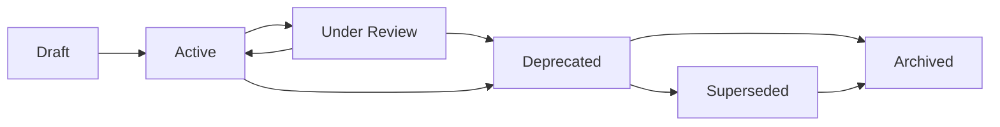

# Document Lifecycle — Tuba Knowledge Platform

> **Part of:** [AI_KNOWLEDGE_PLATFORM.md](../AI_KNOWLEDGE_PLATFORM.md)
> **Purpose:** defines the states a document moves through from creation to retirement, and the rules for each transition — so the platform degrades gracefully as it grows rather than accumulating silent rot.
> **Owner:** Knowledge Platform maintainer
> **Review frequency:** annually

---

## 1. The Lifecycle States

| State | Meaning | Frontmatter `status` value |
|---|---|---|
| **Draft** | Written but not yet approved for use — do not cite as authoritative | `draft` |
| **Active** | Current, in use, authoritative | `active` |
| **Under Review** | Scheduled/triggered review in progress — still usable, but check for imminent changes | `active` (with a note in the document) |
| **Deprecated** | Being phased out — still readable for context, but no longer the source of truth for new work | `deprecated` |
| **Superseded** | Fully replaced by a named newer document | `superseded` |
| **Archived** | Retained for historical record only, removed from active navigation (INDEX.md, AI_INDEX.md) | not applicable — moved out of active indexes |

## 2. Creation

A new document enters as **Draft**. Before it can move to **Active**:
- [ ] Passes the New Document Checklist ([NAMING_CONVENTION.md §5](NAMING_CONVENTION.md))
- [ ] Has complete frontmatter ([FRONTMATTER_STANDARD.md](FRONTMATTER_STANDARD.md))
- [ ] Is linked from at least one existing document and appears in [../knowledge-graph/INDEX.md](../knowledge-graph/INDEX.md) (an orphaned document is not truly Active — see [../knowledge-graph/RELATIONSHIPS.md](../knowledge-graph/RELATIONSHIPS.md)'s warning against orphaned documents)
- [ ] Approved per its domain's ownership (Brand Owner for foundational documents, the relevant lead for execution documents)

## 3. Active Maintenance

An **Active** document is maintained per its own stated `review_frequency`. At each review:
- Confirm content is still accurate against any new [brand-memory/](../brand-memory/) evidence (per the promotion logic in [../knowledge-graph/ONTOLOGY.md §6](../knowledge-graph/ONTOLOGY.md))
- Update `last_updated`
- If the review surfaces a need for significant change, log the change rationale to [../brand-evolution/DECISIONS.md](../brand-evolution/DECISIONS.md) before editing

## 4. Migration to Frontmatter (existing documents)

Documents written before the [FRONTMATTER_STANDARD.md](FRONTMATTER_STANDARD.md) was formalized use the equivalent prose-header convention. Migrate opportunistically:
- When a document is substantively edited for any other reason, add full frontmatter at the same time
- Do not run a dedicated retroactive migration project purely for frontmatter's sake — the prose-header convention already carries the same information for human readers

## 5. Deprecation

A document is marked **Deprecated** when its content is superseded by real-world change (a new official brand guideline, a regulatory change, a confirmed brand-memory pattern that contradicts it) but a direct replacement document doesn't yet exist. Rules:
- Add a visible note at the top of the deprecated document pointing to why and to any interim guidance
- Remove it from "Always-load" designations in [../knowledge-graph/INDEX.md](../knowledge-graph/INDEX.md) immediately — a deprecated document should never be defaulted into an AI's context

## 6. Supersession

A document is marked **Superseded** when a specific, named replacement document exists. Rules:
- The old document's frontmatter `related_documents` field must name the replacement
- The new document's frontmatter should note what it supersedes
- Update every inbound link across the platform to point to the new document — a superseded document should have zero active inbound links within one review cycle

## 7. Archival

A document is **Archived** (removed from active navigation but not deleted) when it's no longer relevant even for context, but deleting it would lose historical/institutional memory value. Rules:
- Move out of [../knowledge-graph/INDEX.md](../knowledge-graph/INDEX.md) and [../knowledge-graph/AI_INDEX.md](../knowledge-graph/AI_INDEX.md)
- Log the archival decision and reason in [../brand-evolution/CHANGELOG.md](../brand-evolution/CHANGELOG.md)
- **Never delete outright** — this platform's core value depends on preserved history (see [../brand-memory/README.md §5](../brand-memory/README.md)'s no-deletion policy, which applies with equal force here)

## 8. Special Case: brand-memory/ Documents

Living-log documents in `brand-memory/` don't follow this lifecycle in the same way — they are permanently **Active** and append-only by design (see [../brand-memory/README.md](../brand-memory/README.md)). Individual *entries* within them are never deleted, but the document itself never moves to Deprecated/Superseded/Archived.

---

## Best Practices
- Review the Deprecated and Superseded lists quarterly to ensure no stale inbound links remain
- Treat "Draft" as a genuine gate, not a formality — an unreviewed Draft document should never be cited as authoritative guidance

## Common Mistakes
- Leaving a superseded document's old inbound links unfixed, creating a confusing fork where two documents both claim authority
- Deleting a document instead of archiving it, losing institutional memory permanently

## Cross-references
- The metadata field that tracks lifecycle state: [FRONTMATTER_STANDARD.md §2](FRONTMATTER_STANDARD.md)
- Where deprecation/supersession decisions are logged: [../brand-evolution/CHANGELOG.md](../brand-evolution/CHANGELOG.md), [../brand-evolution/DECISIONS.md](../brand-evolution/DECISIONS.md)
