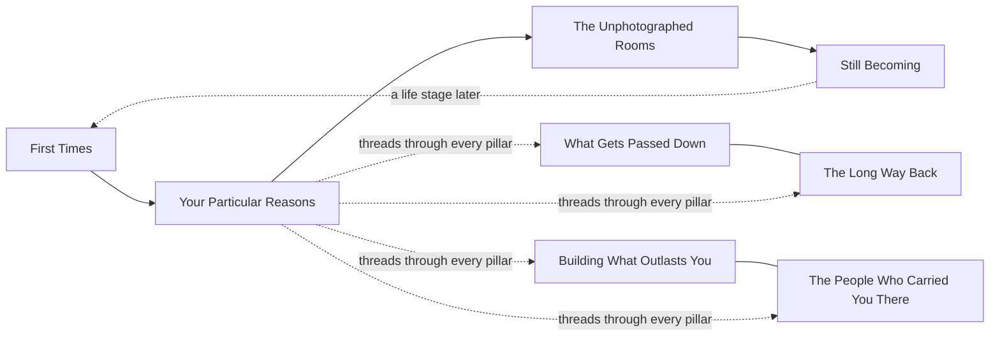

# Narrative Pillars

> **Part of:** [`../NARRATIVE_SYSTEM.md`](../NARRATIVE_SYSTEM.md) · **Builds on:** [`NARRATIVE_MANIFESTO.md`](NARRATIVE_MANIFESTO.md), [`WORLD_BUILDING.md`](WORLD_BUILDING.md)
> **Not to be confused with:** [`../advertising-system/content-system.md`](../advertising-system/content-system.md) §1's *content pillars* (Guidance & Education, Property Showcase, etc.) — those organize what Tuba *publishes*, by format and funnel role. These pillars organize what Tuba *tells stories about*, for the next decade, regardless of format. A single narrative pillar can produce content across every content-system.md pillar at once.

These eight pillars are not generic real-estate themes borrowed from category convention — each is derived directly from the approved platform, **[Everyone's Tuba Is Different](../BIG_IDEA_PLATFORM.md)**. If a theme doesn't trace back to that idea's core claim — that belonging is radically personal, not a shared fantasy — it isn't listed here, no matter how common it is in the category (see `BIG_IDEA_PLATFORM.md` Part One's rejected clichés).

---

## 1. First Times

**What it explores:** the specific, unrepeatable version of a "first" — first key, first night in an empty apartment, first time affording rent alone, first time a parent visits the place their child bought.
**Why it emerges from the big idea:** everyone's *first* is different — the emotional register of a first-time buyer's key-turn is nothing like a growing family's, which is nothing like a retiree's first morning downsizing into somewhere smaller. One moment, infinite specific versions.
**Emotional territory:** Excitement, Relief, quiet Pride (see [`EMOTIONAL_SYSTEM.md`](EMOTIONAL_SYSTEM.md)).
**Naturally serves:** The First Home Seeker, The Optimist (see [`CHARACTER_ARCHETYPES.md`](CHARACTER_ARCHETYPES.md)).
**Scalability:** effectively unlimited — every real customer eventually has one specific "first" worth telling.

## 2. Your Particular Reasons

**What it explores:** the direct dramatization of the big idea itself — why *this* place, for *this* person, and no one else. The pillar most explicitly about the individuality of "a tuba."
**Why it emerges from the big idea:** it *is* the big idea, told through specific reasons rather than stated as a claim — a person choosing a place for a reason that would make no sense to anyone but them (proximity to a specific mosque, a view of a specific mountain, a street that reminds them of a childhood city).
**Emotional territory:** Confidence, Belonging.
**Naturally serves:** The Quiet Achiever, The Dream Builder.
**Scalability:** the most flexible pillar in the system — works for luxury, mass-market, investment, and B2B stories alike, since everyone has particular reasons, including businesses.

## 3. What Gets Passed Down

**What it explores:** homes as inheritance — not just of property, but of habits, recipes, rituals, and rooms that outlive the person who built them. A grandmother's majlis repurposed by grandchildren. A family's Friday-lunch table moving three houses over three generations.
**Why it emerges from the big idea:** what gets "passed down" is never identical from family to family — every household inherits a different set of rituals worth protecting.
**Emotional territory:** Nostalgia, Gratitude, Pride.
**Naturally serves:** The Family Protector, The Returning Son.
**Scalability:** deep, generational content — strong fit for longer-form/documentary-style storytelling (see [`FUTURE_EXPANSION.md`](FUTURE_EXPANSION.md)).

## 4. The Long Way Back

**What it explores:** distance and return — people who left (for study, for work, for any reason) and the specific, textured experience of coming back. Not a generic "coming home" sentiment — always the particular road, the particular smell, the particular relative waiting at the door.
**Why it emerges from the big idea:** everyone's "away" is different, so everyone's "back" lands differently too — the platform's earlier-considered idea *Return* (`BIG_IDEA_PLATFORM.md` Part Five, survivor #3) lives on here as a pillar rather than the platform itself, which is exactly the right altitude for it.
**Emotional territory:** Peace, Nostalgia, Relief.
**Naturally serves:** The Returning Son, The Neighbor.
**Scalability:** strong seasonal natural fit (see [`CAMPAIGN_UNIVERSE.md`](CAMPAIGN_UNIVERSE.md)) without ever being *only* seasonal.

## 5. The Unphotographed Rooms

**What it explores:** the parts of a home that never make it into a listing photo — the prayer corner, the specific chair by the window, the kitchen counter where the real conversations happen, the balcony where someone drinks coffee alone before anyone else wakes up.
**Why it emerges from the big idea:** a listing shows the same five rooms every buyer sees; this pillar insists that the room that actually *matters* is different for every single person, and it's rarely the one in the photos.
**Emotional territory:** Peace, Security, quiet Belonging.
**Naturally serves:** The Quiet Achiever, The Guide (as an observer of these rooms, rarely their subject).
**Scalability:** the pillar best suited to short, frequent, low-production content — a strong everyday-cadence engine, not only hero moments.

## 6. Building What Outlasts You

**What it explores:** legacy-scale thinking — developers building communities meant to be inherited, investors thinking in decades not quarters, a family building a home meant for grandchildren not yet born.
**Why it emerges from the big idea:** "different" applies at scale too — a developer's reasons for building a specific community are as particular as an individual's reasons for choosing one.
**Emotional territory:** Achievement, Pride, Growth.
**Naturally serves:** The Patient Investor, The Dream Builder — and, notably, this is the pillar's natural home for developer and investor stories without ever making the property the protagonist (`WORLD_BUILDING.md`'s hard rule).
**Scalability:** primary pillar for B2B/developer/investor storytelling (see [`CAMPAIGN_UNIVERSE.md`](CAMPAIGN_UNIVERSE.md)).

## 7. The People Who Carried You There

**What it explores:** the guide, agent, or broker's role — told from the *outside*, rarely centered, but present in almost every other pillar's story as the quiet presence that made the outcome possible.
**Why it emerges from the big idea:** if everyone's path to belonging is different, then the kind of help each person actually needed was different too — some needed patience, some needed speed, some needed someone to simply believe them.
**Emotional territory:** Gratitude, Confidence.
**Naturally serves:** The Guide, The Neighbor.
**Scalability:** the primary pillar for broker/agent-facing storytelling — proof-of-value told as narrative rather than case-study data (which stays the job of `advertising-system/content-system.md` §4.8).

## 8. Still Becoming

**What it explores:** the idea that a home is never a finished, static achievement — it keeps changing as the people inside it do. A nursery becomes a study becomes a guest room becomes, one day, a grandchild's room again.
**Why it emerges from the big idea:** if belonging is personal, it's also not permanent — everyone's *evolving* definition of "enough" is different too, and this pillar is the one that refuses to let any story end with "and they lived happily ever after, unchanged."
**Emotional territory:** Growth, Hope.
**Naturally serves:** every archetype, at a different life stage — the pillar most explicitly built to *recur* across a single customer's entire relationship with Tuba, not just their first transaction.
**Scalability:** the pillar with the strongest long-term retention/community storytelling fit.

---

## How the Pillars Relate to Each Other

**Pillar 2 (Your Particular Reasons) is the hub.** Every other pillar is a specific *context* in which "everyone's tuba is different" plays out — a first home, an inheritance, a homecoming, a private room, a legacy investment, a guide's quiet help, or a life still changing. No story needs to use only one pillar; the richest ones sit at an intersection.

## Cross-references
- The idea all eight pillars express: [`../BIG_IDEA_PLATFORM.md`](../BIG_IDEA_PLATFORM.md)
- The recurring people who populate these pillars: [`CHARACTER_ARCHETYPES.md`](CHARACTER_ARCHETYPES.md)
- The raw material generated from these pillars: [`STORY_LIBRARY.md`](STORY_LIBRARY.md)
- How these pillars expand into different campaign categories: [`CAMPAIGN_UNIVERSE.md`](CAMPAIGN_UNIVERSE.md)
