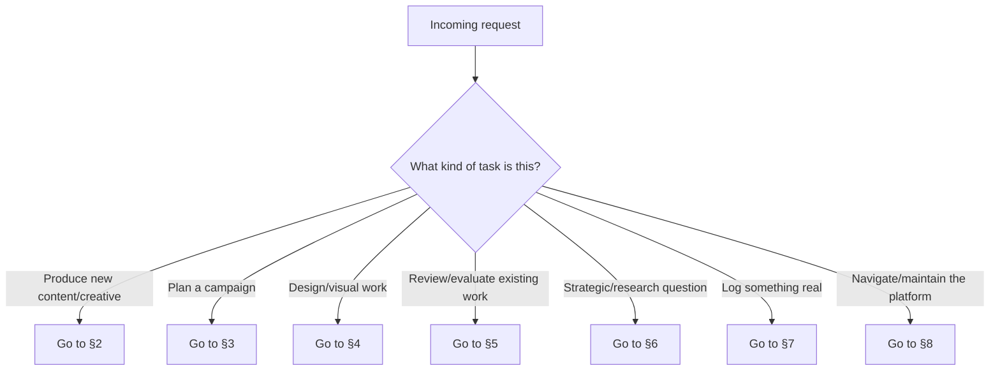
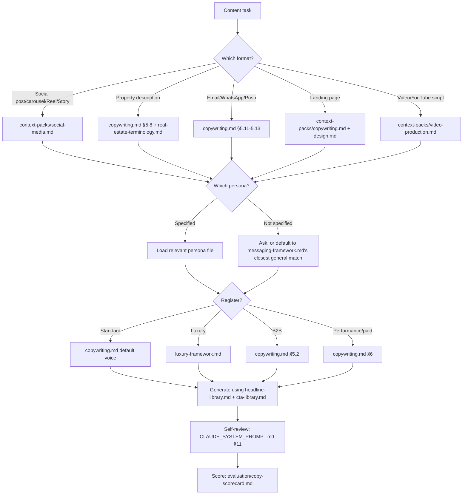
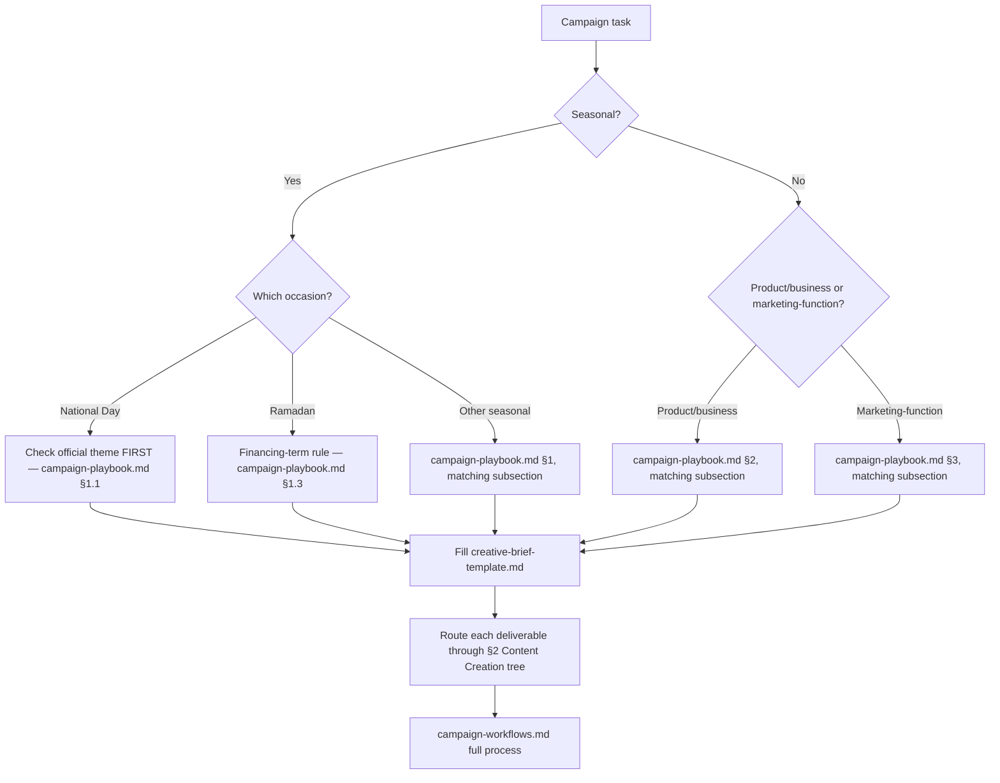
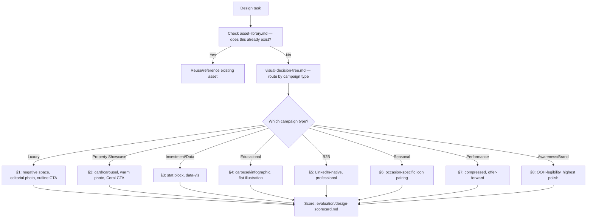
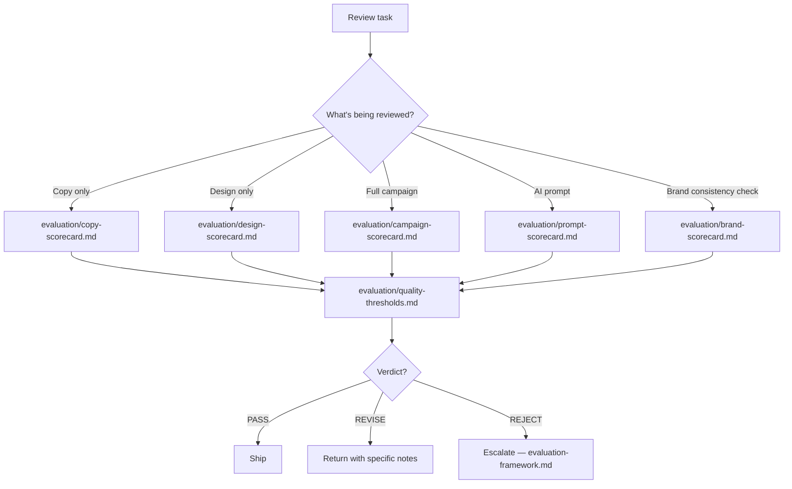
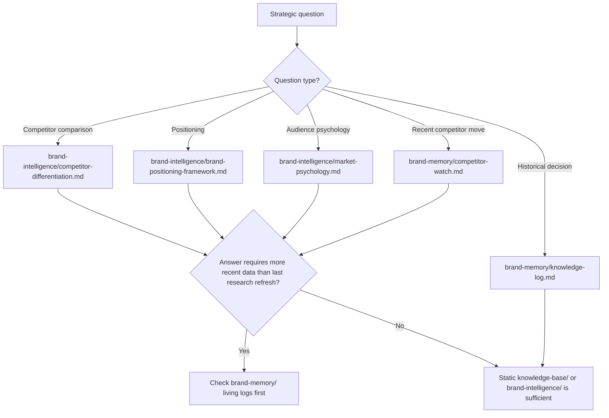
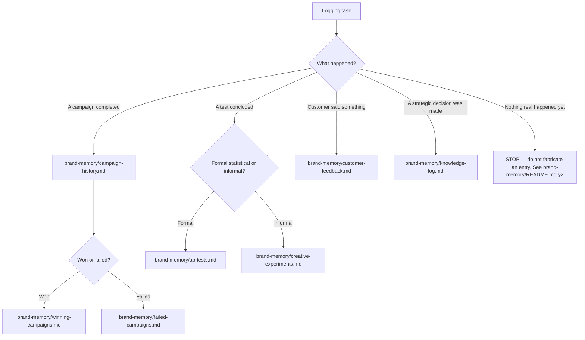
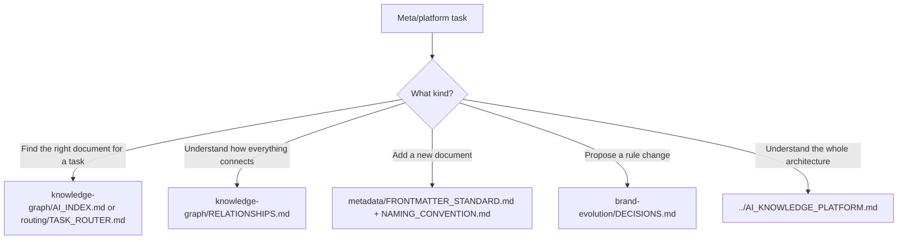

# Decision Tree — Task Routing Visualized

> **Part of:** [AI_KNOWLEDGE_PLATFORM.md](../AI_KNOWLEDGE_PLATFORM.md)
> **Purpose:** the visual (Mermaid) counterpart to [TASK_ROUTER.md](TASK_ROUTER.md)'s table and [TASK_LIBRARY.md](TASK_LIBRARY.md)'s definitions — trace an incoming request through these decision trees to arrive at the correct reading order without scanning the full table.
> **Owner:** Knowledge Platform maintainer
> **Review frequency:** whenever routing logic changes

---

## 1. Master Routing Decision Tree

## 2. Content Creation Routing

## 3. Campaign Planning Routing

## 4. Design & Visual Routing

## 5. Review & Evaluation Routing

## 6. Strategy & Research Routing

## 7. Memory & Logging Routing

## 8. Platform Navigation & Maintenance Routing

---

## Best Practices
- Start at §1 (Master Routing) for any ambiguous request — it's designed to sort into exactly one of the seven sub-trees within one decision
- Treat "STOP — do not fabricate" (§7) as a hard stop, not a soft suggestion — this is the same honesty principle enforced throughout brand-memory/

## Common Mistakes
- Jumping straight to a sub-tree without confirming the task type at §1 — a design task routed through the Content tree will miss visual-decision-tree.md entirely
- Treating the diagrams as optional decoration rather than literal, followable logic

## Cross-references
- The table version of this same logic: [TASK_ROUTER.md](TASK_ROUTER.md)
- Task definitions and required inputs: [TASK_LIBRARY.md](TASK_LIBRARY.md)
- The ontological reasoning behind this routing model: [../knowledge-graph/ONTOLOGY.md §8](../knowledge-graph/ONTOLOGY.md)
